# ИТОГОВЫЙ ОТЧЁТ ПО ПРОИЗВОДСТВЕННОЙ ПРАКТИКЕ

## Тема: «Анализ и формализация требований к сайту "CRM система: Анализ продаж"»

**Студент:** [ФИО студента]  
**Организация:** ООО «Дальневосточный фермер»  
**Период практики:** 2025 г.  
**Руководитель практики:** [ФИО руководителя]

---

## СОДЕРЖАНИЕ

1. [Введение](#введение)
2. [ER-диаграмма базы данных](#er-диаграмма-базы-данных)
3. [Структура таблиц базы данных](#структура-таблиц-базы-данных)
4. [Структура пользовательского интерфейса](#структура-пользовательского-интерфейса)
5. [Система авторизации и регистрации](#система-авторизации-и-регистрации)
6. [Система учёта CRM](#система-учёта-crm)
7. [Заключение](#заключение)

---

## ВВЕДЕНИЕ

### Цель практики
Разработка CRM-системы для автоматизации процессов анализа продаж и управления задачами в ООО «Дальневосточный фермер».

### Задачи практики
1. Анализ предметной области агробизнеса
2. Исследование существующих CRM-систем
3. Формализация бизнес-требований
4. Проектирование архитектуры системы
5. Разработка функционального прототипа
6. Реализация системы управления задачами и аналитики

### Ожидаемые результаты
- Рост продаж на 15% в течение года
- Снижение оттока клиентов с 12% до 7%
- Сокращение времени на аналитику с 12 до 2 часов в неделю
- Сокращение времени реакции на изменения с 3 дней до 1 часа

---

## ER-ДИАГРАММА БАЗЫ ДАННЫХ

### Общая характеристика

База данных проекта содержит **48 таблиц**, включая:
- **35 основных сущностей** предметной области
- **8 связующих таблиц** для отношений ManyToMany
- **5 системных таблиц** Symfony

### Диаграмма основных сущностей

```
┌─────────────────────────────────────────────────────────────────────────────┐
│                           ER-ДИАГРАММА БД (основные связи)                  │
└─────────────────────────────────────────────────────────────────────────────┘

┌──────────────┐       ┌──────────────┐       ┌──────────────┐
│    USERS     │──────<│    TASKS     │>──────│TASK_CATEGORIES│
└──────────────┘       └──────────────┘       └──────────────┘
       │                      │
       │                      ├──────────>┌──────────────┐
       │                      │           │   COMMENTS   │
       │                      │           └──────────────┘
       │                      │
       │                      ├──────────>┌──────────────┐
       │                      │           │ACTIVITY_LOGS │
       │                      │           └──────────────┘
       │                      │
       │                      ├──────────>┌──────────────┐
       │                      │           │TAGS (M:M)    │
       │                      │           └──────────────┘
       │
       ├──────────>┌──────────────┐
       │           │   CLIENTS    │>──────┌──────────────┐
       │           └──────────────┘       │    DEALS     │
       │                                  └──────────────┘
       │                                         │
       │                                         ├──────────>┌──────────────┐
       │                                         │           │DEAL_HISTORY  │
       │                                         │           └──────────────┘
       │
       ├──────────>┌──────────────┐
       │           │    GOALS     │>──────┌──────────────┐
       │           └──────────────┘       │GOAL_MILESTONES│
       │
       ├──────────>┌──────────────┐
       │           │   HABITS     │>──────┌──────────────┐
       │           └──────────────┘       │   HABIT_LOGS │
       │
       ├──────────>┌──────────────┐
       │           │NOTIFICATIONS │
       │           └──────────────┘
       │
       ├──────────>┌──────────────┐
       │           │WEBHOOKS      │>──────┌──────────────┐
       │           └──────────────┘       │ WEBHOOK_LOGS │
       │
       ├──────────>┌──────────────┐
       │           │ RESOURCES    │>──────┌──────────────┐
       │           └──────────────┘       │ALLOCATIONS   │
       │
       └──────────>┌──────────────┐
                   │KNOWLEDGE_BASE│
                   └──────────────┘
```

### Полная ER-диаграмма (Mermaid)

```mermaid
erDiagram
    USERS ||--o{ TASKS : creates
    USERS ||--o{ TASKS : assigned
    USERS ||--o{ TASK_CATEGORIES : owns
    USERS ||--o{ COMMENTS : authors
    USERS ||--o{ ACTIVITY_LOGS : generates
    USERS ||--o{ NOTIFICATIONS : receives
    USERS ||--o{ TIME_TRACKING : logs
    USERS ||--o{ TAGS : owns
    USERS ||--o{ ARTICLES : writes
    USERS ||--o{ WEBHOOKS : configures
    USERS ||--o{ FILTER_VIEWS : saves
    USERS ||--o{ TASK_TEMPLATES : creates
    USERS ||--o{ CLIENTS : manages
    USERS ||--o{ DEALS : handles
    USERS ||--o{ GOALS : owns
    USERS ||--o{ HABITS : tracks
    USERS ||--|| NOTIFICATION_PREF : has
    
    TASKS ||--o{ COMMENTS : contains
    TASKS ||--o{ ACTIVITY_LOGS : generates
    TASKS ||--o{ TASK_NOTIFICATIONS : triggers
    TASKS ||--o{ TIME_TRACKING : tracks
    TASKS ||--o{ TASK_ATTACHMENTS : has
    TASKS ||--o{ TASK_DEPENDENCIES : depends
    TASKS ||--o{ TASK_HISTORY : records
    TASKS }|--|{ TAGS : tagged
    TASKS ||--o{ TASK_RECURRENCE : repeats
    TASKS ||--o{ RESOURCE_ALLOC : allocates
    
    CLIENTS ||--o{ DEALS : has
    CLIENTS ||--o{ CLIENT_INTERACTIONS : contacts
    
    DEALS ||--o{ DEAL_HISTORY : tracks
    
    GOALS ||--o{ GOAL_MILESTONES : contains
    
    HABITS ||--o{ HABIT_LOGS : records
    
    KNOWLEDGE_BASE_ARTICLES }|--|{ KNOWLEDGE_BASE_CATEGORIES : categorized
    KNOWLEDGE_BASE_ARTICLES }|--|{ TAGS : tagged
    KNOWLEDGE_BASE_ARTICLES ||--o{ KNOWLEDGE_BASE_ARTICLES : parent_child
    
    KNOWLEDGE_BASE_CATEGORIES ||--o{ KNOWLEDGE_BASE_CATEGORIES : parent_child
    
    RESOURCES }|--|{ SKILLS : possesses
    RESOURCES ||--o{ RESOURCE_ALLOC : assigned
    
    TASKS }|--|{ SKILLS : requires
    
    WEBHOOKS ||--o{ WEBHOOK_LOGS : logs
    
    FILTER_VIEWS }|--|{ USERS : shared_with
    
    TASK_TEMPLATES ||--o{ TASK_TEMPLATE_ITEMS : contains
```



---

## СТРУКТУРА ТАБЛИЦ БАЗЫ ДАННЫХ

### 1. Ядро системы

#### Таблица: `users`
| Поле | Тип | Описание |
|------|-----|----------|
| id | INTEGER | Первичный ключ |
| username | VARCHAR(180) | Уникальное имя пользователя |
| email | VARCHAR(180) | Уникальный email |
| roles | JSON | Роли пользователя |
| password | VARCHAR(255) | Хэш пароля |
| firstName | VARCHAR(100) | Имя |
| lastName | VARCHAR(100) | Фамилия |
| phone | VARCHAR(20) | Телефон (+7XXXXXXXXXX) |
| position | VARCHAR(255) | Должность |
| department | VARCHAR(255) | Отдел |
| isActive | BOOLEAN | Активность аккаунта |
| lastLoginAt | DATETIME | Последний вход |
| totpSecret | VARCHAR(255) | Секрет 2FA |
| isTotpEnabled | BOOLEAN | Включён 2FA |
| createdAt | DATETIME | Дата создания |

#### Таблица: `tasks`
| Поле | Тип | Описание |
|------|-----|----------|
| id | INTEGER | Первичный ключ |
| title | VARCHAR(255) | Заголовок задачи |
| description | TEXT | Описание |
| status | VARCHAR(20) | Статус (pending, in_progress, done) |
| priority | VARCHAR(20) | Приоритет (low, medium, high, urgent) |
| dueDate | DATETIME | Дедлайн |
| completedAt | DATETIME | Дата завершения |
| progress | INTEGER | Прогресс (0-100) |
| user_id | INTEGER | Создатель задачи (FK → users) |
| assigned_user_id | INTEGER | Исполнитель (FK → users) |
| category_id | INTEGER | Категория (FK → task_categories) |
| parent_id | INTEGER | Родительская задача (FK → tasks) |

#### Таблица: `task_categories`
| Поле | Тип | Описание |
|------|-----|----------|
| id | INTEGER | Первичный ключ |
| name | VARCHAR(255) | Название категории |
| description | TEXT | Описание |
| user_id | INTEGER | Владелец (FK → users) |

#### Таблица: `tags`
| Поле | Тип | Описание |
|------|-----|----------|
| id | INTEGER | Первичный ключ |
| name | VARCHAR(50) | Название тега |
| color | VARCHAR(7) | HEX-цвет (#007bff) |
| user_id | INTEGER | Владелец (FK → users) |

#### Таблица: `task_tags` (связующая)
| Поле | Тип | Описание |
|------|-----|----------|
| task_id | INTEGER | Задача (FK → tasks) |
| tag_id | INTEGER | Тег (FK → tags) |

### 2. CRM модуль

#### Таблица: `clients`
| Поле | Тип | Описание |
|------|-----|----------|
| id | INTEGER | Первичный ключ |
| companyName | VARCHAR(255) | Название компании |
| inn | VARCHAR(12) | ИНН |
| kpp | VARCHAR(9) | КПП |
| contactPerson | VARCHAR(255) | Контактное лицо |
| phone | VARCHAR(20) | Телефон |
| email | VARCHAR(180) | Email |
| segment | VARCHAR(50) | Сегмент (retail, wholesale) |
| manager_id | INTEGER | Менеджер (FK → users) |

#### Таблица: `deals`
| Поле | Тип | Описание |
|------|-----|----------|
| id | INTEGER | Первичный ключ |
| title | VARCHAR(255) | Название сделки |
| amount | DECIMAL(15,2) | Сумма |
| stage | VARCHAR(50) | Этап (lead, negotiation, contract, closed) |
| status | VARCHAR(50) | Статус |
| expectedCloseDate | DATE | Ожидаемая дата закрытия |
| client_id | INTEGER | Клиент (FK → clients) |
| manager_id | INTEGER | Менеджер (FK → users) |

#### Таблица: `deal_history`
| Поле | Тип | Описание |
|------|-----|----------|
| id | INTEGER | Первичный ключ |
| action | VARCHAR(100) | Действие |
| oldValue | JSON | Старое значение |
| newValue | JSON | Новое значение |
| deal_id | INTEGER | Сделка (FK → deals) |
| user_id | INTEGER | Пользователь (FK → users) |

#### Таблица: `client_interactions`
| Поле | Тип | Описание |
|------|-----|----------|
| id | INTEGER | Первичный ключ |
| interactionType | VARCHAR(50) | Тип (call, email, meeting) |
| interactionDate | DATETIME | Дата взаимодействия |
| description | TEXT | Описание |
| client_id | INTEGER | Клиент (FK → clients) |
| user_id | INTEGER | Пользователь (FK → users) |

#### Таблица: `products`
| Поле | Тип | Описание |
|------|-----|----------|
| id | INTEGER | Первичный ключ |
| name | VARCHAR(255) | Название |
| sku | VARCHAR(100) | Артикул (уникальный) |
| price | DECIMAL(15,2) | Цена |
| cost | DECIMAL(15,2) | Себестоимость |
| isActive | BOOLEAN | Активен |

### 3. Коммуникации

#### Таблица: `comments`
| Поле | Тип | Описание |
|------|-----|----------|
| id | INTEGER | Первичный ключ |
| content | TEXT | Текст комментария |
| author_id | INTEGER | Автор (FK → users) |
| task_id | INTEGER | Задача (FK → tasks) |

#### Таблица: `notifications`
| Поле | Тип | Описание |
|------|-----|----------|
| id | INTEGER | Первичный ключ |
| title | VARCHAR(255) | Заголовок |
| message | TEXT | Сообщение |
| isRead | BOOLEAN | Прочитано |
| type | VARCHAR(50) | Тип (info, warning, error) |
| channel | VARCHAR(50) | Канал (in_app, email, push) |
| user_id | INTEGER | Получатель (FK → users) |

#### Таблица: `notification_preferences`
| Поле | Тип | Описание |
|------|-----|----------|
| id | INTEGER | Первичный ключ |
| emailSettings | JSON | Настройки email |
| pushSettings | JSON | Настройки push |
| quietHours | JSON | Тихие часы |
| user_id | INTEGER | Пользователь (FK → users) |

### 4. Аналитика и отчётность

#### Таблица: `activity_logs`
| Поле | Тип | Описание |
|------|-----|----------|
| id | INTEGER | Первичный ключ |
| action | TEXT | Действие |
| eventType | VARCHAR(20) | Тип события |
| user_id | INTEGER | Пользователь (FK → users) |
| task_id | INTEGER | Задача (FK → users, nullable) |

#### Таблица: `task_history`
| Поле | Тип | Описание |
|------|-----|----------|
| id | INTEGER | Первичный ключ |
| action | VARCHAR(50) | Действие |
| field | VARCHAR(100) | Поле |
| oldValue | TEXT | Старое значение |
| newValue | TEXT | Новое значение |
| task_id | INTEGER | Задача (FK → tasks) |
| user_id | INTEGER | Пользователь (FK → users) |

#### Таблица: `task_time_tracking`
| Поле | Тип | Описание |
|------|-----|----------|
| id | INTEGER | Первичный ключ |
| timeSpent | TIME | Потраченное время |
| durationSeconds | INTEGER | Длительность (сек) |
| dateLogged | DATETIME | Дата записи |
| user_id | INTEGER | Пользователь (FK → users) |
| task_id | INTEGER | Задача (FK → tasks) |

### 5. Планирование и цели

#### Таблица: `goals`
| Поле | Тип | Описание |
|------|-----|----------|
| id | INTEGER | Первичный ключ |
| title | VARCHAR(255) | Название цели |
| startDate | DATETIME | Дата начала |
| endDate | DATETIME | Дата окончания |
| targetValue | DECIMAL(5,2) | Целевое значение |
| currentValue | DECIMAL(5,2) | Текущее значение |
| status | VARCHAR(50) | Статус |
| owner_id | INTEGER | Владелец (FK → users) |

#### Таблица: `goal_milestones`
| Поле | Тип | Описание |
|------|-----|----------|
| id | INTEGER | Первичный ключ |
| title | VARCHAR(255) | Название этапа |
| dueDate | DATETIME | Срок |
| completed | BOOLEAN | Выполнено |
| goal_id | INTEGER | Цель (FK → goals) |

#### Таблица: `habits`
| Поле | Тип | Описание |
|------|-----|----------|
| id | INTEGER | Первичный ключ |
| name | VARCHAR(255) | Название привычки |
| frequency | VARCHAR(50) | Частота (daily, weekly) |
| weekDays | JSON | Дни недели |
| targetCount | INTEGER | Целевое количество |
| user_id | INTEGER | Пользователь (FK → users) |

#### Таблица: `habit_logs`
| Поле | Тип | Описание |
|------|-----|----------|
| id | INTEGER | Первичный ключ |
| date | DATE | Дата |
| count | INTEGER | Количество выполнений |
| habit_id | INTEGER | Привычка (FK → habits) |

### 6. Автоматизация

#### Таблица: `task_recurrences`
| Поле | Тип | Описание |
|------|-----|----------|
| id | INTEGER | Первичный ключ |
| frequency | VARCHAR(20) | Частота (daily, weekly, monthly) |
| interval | INTEGER | Интервал |
| daysOfWeek | TEXT | Дни недели |
| endDate | DATE | Дата окончания |
| task_id | INTEGER | Задача (FK → tasks) |

#### Таблица: `task_automation`
| Поле | Тип | Описание |
|------|-----|----------|
| id | INTEGER | Первичный ключ |
| name | VARCHAR(255) | Название правила |
| trigger | VARCHAR(50) | Триггер |
| conditions | JSON | Условия |
| actions | JSON | Действия |
| isActive | BOOLEAN | Активно |
| createdBy_id | INTEGER | Создатель (FK → users) |

#### Таблица: `task_templates`
| Поле | Тип | Описание |
|------|-----|----------|
| id | INTEGER | Первичный ключ |
| name | VARCHAR(100) | Название шаблона |
| templateData | JSON | Данные шаблона |
| isPublic | BOOLEAN | Публичный |
| usageCount | INTEGER | Количество использований |
| user_id | INTEGER | Пользователь (FK → users) |

### 7. База знаний

#### Таблица: `knowledge_base_articles`
| Поле | Тип | Описание |
|------|-----|----------|
| id | INTEGER | Первичный ключ |
| title | VARCHAR(255) | Заголовок |
| content | TEXT | Содержание |
| status | VARCHAR(50) | Статус (draft, published) |
| viewCount | INTEGER | Количество просмотров |
| author_id | INTEGER | Автор (FK → users) |
| parent_article_id | INTEGER | Родительская статья |

#### Таблица: `knowledge_base_categories`
| Поле | Тип | Описание |
|------|-----|----------|
| id | INTEGER | Первичный ключ |
| name | VARCHAR(255) | Название |
| slug | VARCHAR(255) | URL-слаг |
| parent_category_id | INTEGER | Родительская категория |

### 8. Интеграции

#### Таблица: `webhooks`
| Поле | Тип | Описание |
|------|-----|----------|
| id | INTEGER | Первичный ключ |
| name | VARCHAR(255) | Название |
| url | VARCHAR(2048) | URL вебхука |
| secret | VARCHAR(64) | Секретный ключ |
| events | JSON | События |
| user_id | INTEGER | Пользователь (FK → users) |

#### Таблица: `webhook_logs`
| Поле | Тип | Описание |
|------|-----|----------|
| id | INTEGER | Первичный ключ |
| payload | JSON | Данные запроса |
| response | JSON | Ответ |
| statusCode | INTEGER | HTTP статус |
| isSuccess | BOOLEAN | Успешно |
| webhook_id | INTEGER | Вебхук (FK → webhooks) |

### 9. Системные таблицы

#### Таблица: `reset_password_request`
| Поле | Тип | Описание |
|------|-----|----------|
| id | INTEGER | Первичный ключ |
| selector | VARCHAR(20) | Селектор токена |
| hashedToken | VARCHAR(100) | Хэш токена |
| expiresAt | DATETIME | Срок действия |
| user_id | INTEGER | Пользователь (FK → users) |

#### Таблица: `messenger_messages` (Symfony Messenger)
| Поле | Тип | Описание |
|------|-----|----------|
| id | INTEGER | Первичный ключ |
| body | TEXT | Тело сообщения |
| headers | TEXT | Заголовки |
| queue_name | VARCHAR(190) | Название очереди |
| created_at | DATETIME | Дата создания |
| delivered_at | DATETIME | Дата доставки |

---

## СТРУКТУРА ПОЛЬЗОВАТЕЛЬСКОГО ИНТЕРФЕЙСА

### Общая архитектура интерфейса

```
┌─────────────────────────────────────────────────────────────────┐
│                        HEADER (шапка)                           │
│  [Logo] [Поиск] [Быстрые действия] [Уведомления] [Профиль]     │
├────────────┬────────────────────────────────────────────────────┤
│            │                                                    │
│   SIDEBAR  │              MAIN CONTENT AREA                     │
│            │                                                    │
│  • Дашборд │  ┌──────────────────────────────────────────────┐ │
│  • Задачи  │  │                                              │ │
│  • Календарь│  │           Контент страницы                   │ │
│  • Канбан  │  │                                              │ │
│  • CRM     │  │  ┌─────────┐  ┌─────────┐  ┌─────────┐      │ │
│  • Клиенты │  │  │ Виджет  │  │ Виджет  │  │ Виджет  │      │ │
│  • Отчёты  │  │  └─────────┘  └─────────┘  └─────────┘      │ │
│  • База знаний│ │                                              │ │
│  • Настройки│  └──────────────────────────────────────────────┘ │
│            │                                                    │
└────────────┴────────────────────────────────────────────────────┘
```

### Навигационная структура

#### Боковое меню (Sidebar)

| Раздел | Подразделы | Описание |
|--------|------------|----------|
| **Дашборд** | - | Главная панель с KPI и метриками |
| **Задачи** | Мои задачи, Назначенные, Просроченные | Управление задачами |
| **Календарь** | День, Неделя, Месяц, iCal Export | Календарь задач |
| **Канбан** | Доски задач | Визуальное управление |
| **CRM** | Дашборд CRM, Воронка продаж | CRM аналитика |
| **Клиенты** | Список, Сегменты | Управление клиентами |
| **Сделки** | Воронка, Архив | Управление сделками |
| **Отчёты** | Продажи, Клиенты, Товары | Аналитические отчёты |
| **База знаний** | Статьи, Категории | Документация |
| **Настройки** | Профиль, Интеграции, Уведомления | Персонализация |

### Страницы системы

#### 1. Страница входа (Login Page)
```
┌──────────────────────────────────────┐
│           TO-DO LIST CRM             │
│                                      │
│  ┌────────────────────────────────┐ │
│  │  Email: [________________]     │ │
│  │  Пароль: [________________]    │ │
│  │  [ ] Запомнить меня            │ │
│  │                                │ │
│  │  [Войти]  [Забыли пароль?]     │ │
│  └────────────────────────────────┘ │
│                                      │
│  [Регистрация] [2FA если включено]  │
└──────────────────────────────────────┘
```

#### 2. Главный дашборд
```
┌─────────────────────────────────────────────────────────────┐
│  Дашборд                                                    │
├─────────────────────────────────────────────────────────────┤
│  ┌─────────────┐ ┌─────────────┐ ┌─────────────┐ ┌────────┐│
│  │ Всего задач │ │ В работе    │ │ Завершено   │ │Просроч ││
│  │    156      │ │     42      │ │     98      │ │   16   ││
│  └─────────────┘ └─────────────┘ └─────────────┘ └────────┘│
│                                                             │
│  ┌───────────────────────┐ ┌───────────────────────────────┐│
│  │  Задачи по статусам   │ │  Активность (7 дней)          ││
│  │  [Круговая диаграмма] │ │  [Линейный график]            ││
│  └───────────────────────┘ └───────────────────────────────┘│
│                                                             │
│  ┌──────────────────────────────────────────────────────────┐│
│  │  Последние задачи                                        ││
│  │  ┌────────────────────────────────────────────────────┐ ││
│  │  │ Задача 1  [Статус] [Приоритет] [Дедлайн] [Действия]│ ││
│  │  │ Задача 2  [Статус] [Приоритет] [Дедлайн] [Действия]│ ││
│  │  └────────────────────────────────────────────────────┘ ││
│  └──────────────────────────────────────────────────────────┐│
└─────────────────────────────────────────────────────────────┘
```

#### 3. Страница задач (Task List)
```
┌─────────────────────────────────────────────────────────────┐
│  Задачи  [+ Новая задача] [Фильтры] [Экспорт] [Вид]        │
├─────────────────────────────────────────────────────────────┤
│  [Поиск задач...] [Категория: v] [Статус: v] [Приоритет: v]│
├─────────────────────────────────────────────────────────────┤
│  ☐ | Заголовок | Статус | Приоритет | Дедлайн | Действия   │
│  ───────────────────────────────────────────────────────────│
│  ☐ | Задача 1  | [Done] | [High]   | 10.03    | [✎] [🗑]  │
│  ☐ | Задача 2  | [Prog] | [Medium] | 15.03    | [✎] [🗑]  │
│  ☐ | Задача 3  | [Pend] | [Low]    | 20.03    | [✎] [🗑]  │
├─────────────────────────────────────────────────────────────┤
│  [< Назад]  1 2 3 4 5  [Вперёд >]                           │
└─────────────────────────────────────────────────────────────┘
```

#### 4. Канбан-доска
```
┌─────────────────────────────────────────────────────────────────────┐
│  Канбан  [+ Новая задача] [Новая колонка]                           │
├─────────────────────────────────────────────────────────────────────┤
│  ┌─────────────┐ ┌─────────────┐ ┌─────────────┐ ┌─────────────┐   │
│  │ Нужно сделать│  В работе     │  На проверке  │  Готово       │   │
│  ├─────────────┤ ├─────────────┤ ├─────────────┤ ├─────────────┤   │
│  │ ┌─────────┐ │ │ ┌─────────┐ │ │ ┌─────────┐ │ │ ┌─────────┐ │   │
│  │ │ Задача  │ │ │ Задача  │ │ │ Задача  │ │ │ Задача  │ │   │
│  │ │ #1      │ │ │ #2      │ │ │ #3      │ │ │ #4      │ │   │
│  │ └─────────┘ │ │ └─────────┘ │ │ └─────────┘ │ │ └─────────┘ │   │
│  │ ┌─────────┐ │ │ ┌─────────┐ │ │             │ │ ┌─────────┐ │   │
│  │ │ Задача  │ │ │ Задача  │ │ │             │ │ │ Задача  │ │   │
│  │ │ #5      │ │ │ #6      │ │ │             │ │ │ #7      │ │   │
│  │ └─────────┘ │ │ └─────────┘ │ │             │ │ └─────────┘ │   │
│  └─────────────┘ └─────────────┘ └─────────────┘ └─────────────┘   │
└─────────────────────────────────────────────────────────────────────┘
```

#### 5. CRM дашборд
```
┌─────────────────────────────────────────────────────────────┐
│  CRM Дашборд                                                │
├─────────────────────────────────────────────────────────────┤
│  ┌─────────────┐ ┌─────────────┐ ┌─────────────┐ ┌────────┐│
│  │ Клиентов    │ │ Сделок      │ │ Выручка     │ │Конверс ││
│  │    234      │ │     87      │ │  4.5 млн    │ │  32%   ││
│  └─────────────┘ └─────────────┘ └─────────────┘ └────────┘│
│                                                             │
│  ┌───────────────────────┐ ┌───────────────────────────────┐│
│  │  Воронка продаж       │ │  Динамика продаж              ││
│  │  [Воронка]            │ │  [График по месяцам]          ││
│  │  Lead → Deal → Close  │ │                               ││
│  └───────────────────────┘ └───────────────────────────────┘│
└─────────────────────────────────────────────────────────────┘
```

#### 6. Профиль пользователя
```
┌─────────────────────────────────────────────────────────────┐
│  Профиль                                                    │
├─────────────────────────────────────────────────────────────┤
│  ┌─────────────┐  Имя: Иванов Иван                         │
│  │  [Аватар]   │  Email: ivan@example.com                  │
│  │             │  Телефон: +79991234567                    │
│  └─────────────┘  Должность: Менеджер проектов             │
│                   Отдел: Продажи                           │
│  [Изменить фото]                                           │
├─────────────────────────────────────────────────────────────┤
│  Вкладки: [Основное] [Безопасность] [Уведомления] [2FA]    │
│                                                             │
│  ┌─────────────────────────────────────────────────────────┐│
│  │  Смена пароля                                           ││
│  │  Текущий: [________]  Новый: [________]  [Сохранить]    ││
│  └─────────────────────────────────────────────────────────┘│
└─────────────────────────────────────────────────────────────┘
```

### Компоненты интерфейса

#### Модальные окна
- Создание/редактирование задачи
- Быстрый поиск (Ctrl+K)
- Настройки уведомлений
- Подтверждение действий

#### Уведомления (Toast)
- Успешные операции (зелёные)
- Предупреждения (жёлтые)
- Ошибки (красные)

#### Выпадающие меню
- Быстрые действия
- Настройки пользователя
- Фильтры и сортировка

---

## СИСТЕМА АВТОРИЗАЦИИ И РЕГИСТРАЦИИ

### Архитектура системы безопасности

```
┌─────────────────────────────────────────────────────────────┐
│                    СИСТЕМА БЕЗОПАСНОСТИ                     │
├─────────────────────────────────────────────────────────────┤
│                                                             │
│  ┌──────────────┐    ┌──────────────┐    ┌──────────────┐  │
│  │  Регистрация │    │    Вход      │    │  Восстановл. │  │
│  └──────────────┘    └──────────────┘    └──────────────┘  │
│         │                   │                   │           │
│         └───────────────────┼───────────────────┘           │
│                             │                               │
│                    ┌────────▼────────┐                      │
│                    │ LoginAuthenticator│                     │
│                    └────────┬────────┘                      │
│                             │                               │
│         ┌───────────────────┼───────────────────┐           │
│         │                   │                   │           │
│  ┌──────▼──────┐   ┌───────▼───────┐   ┌──────▼──────┐     │
│  │ PasswordHash│   │  User Checker │   │  2FA Check  │     │
│  └─────────────┘   └───────────────┘   └─────────────┘     │
│                                                             │
│  ┌─────────────────────────────────────────────────────┐    │
│  │              Ролевая модель (RBAC)                   │    │
│  │  ROLE_USER → ROLE_ANALYST → ROLE_MANAGER → ROLE_ADMIN│   │
│  └─────────────────────────────────────────────────────┘    │
│                                                             │
└─────────────────────────────────────────────────────────────┘
```

### 1. Регистрация пользователя

#### Процесс регистрации

**Контроллер:** `RegistrationController`  
**Маршрут:** `/register`  
**Метод:** GET/POST

**Этапы:**
1. Пользователь заполняет форму регистрации
2. Валидация данных (email, пароль, username)
3. Хэширование пароля (bcrypt)
4. Создание пользователя в БД
5. Редирект на страницу входа

**Требования к паролю:**
- Минимум 8 символов
- Рекомендуется: буквы, цифры, спецсимволы

**Защита от злоупотреблений:**
- Rate limiting (30 секунд между попытками)
- Проверка CSRF-токена
- Уникальность email и username

#### Форма регистрации
```
┌──────────────────────────────────────┐
│         Регистрация                  │
├──────────────────────────────────────┤
│  Логин: [________________]           │
│  Email: [________________]           │
│  Пароль: [________________]          │
│  Повтор пароля: [________________]   │
│                                      │
│  [ ] Согласен с правилами            │
│                                      │
│  [Зарегистрироваться]                │
│                                      │
│  [Уже есть аккаунт? Войти]           │
└──────────────────────────────────────┘
```

### 2. Аутентификация

#### Процесс входа

**Контроллер:** `SecurityController`  
**Аутентификатор:** `LoginAuthenticator`  
**Маршрут:** `/login`

**Алгоритм аутентификации:**

```
1. Пользователь вводит email и пароль
   ↓
2. Проверка CSRF-токена
   ↓
3. Поиск пользователя по email в БД
   ↓
4. Проверка статуса аккаунта
   ├── Активен? → Продолжить
   └── Деактивирован? → Ошибка
   ↓
5. Проверка блокировки
   ├── Не заблокирован? → Продолжить
   └── Заблокирован? → Ошибка
   ↓
6. Обновление lastLoginAt (асинхронно)
   ↓
7. Проверка пароля
   ├── Верный? → Создать сессию
   └── Неверный? → Увеличить счётчик ошибок
   ↓
8. Если 5+ неудачных попыток:
   └── Заблокировать на 15 минут
   ↓
9. Редирект на дашборд
```

#### Форма входа
```
┌──────────────────────────────────────┐
│           ВХОД В СИСТЕМУ             │
├──────────────────────────────────────┤
│  Email: [________________]           │
│  Пароль: [________________]          │
│  [ ] Запомнить меня                  │
│                                      │
│  [Войти]                             │
│                                      │
│  [Забыли пароль?] [Регистрация]      │
└──────────────────────────────────────┘
```

### 3. Двухфакторная аутентификация (2FA)

#### Реализация
**Библиотека:** Scheb TwoFactorBundle  
**Метод:** TOTP (Time-based One-Time Password)  
**Приложение:** Google Authenticator, Authy

#### Процесс включения 2FA
```
1. Пользователь в настройках включает 2FA
   ↓
2. Генерация TOTP-секрета
   ↓
3. Показ QR-кода
   ↓
4. Пользователь сканирует QR телефоном
   ↓
5. Ввод кода из приложения
   ↓
6. Проверка кода
   ↓
7. Сохранение секрета в БД
   ↓
8. Выдача backup-кодов
```

#### Процесс входа с 2FA
```
1. Ввод email и пароля
   ↓
2. Успешная проверка пароля
   ↓
3. Проверка: включён ли 2FA?
   ├── Нет → Вход выполнен
   └── Да → Показать форму 2FA
   ↓
4. Ввод 6-значного кода
   ↓
5. Проверка кода
   ├── Верный → Вход выполнен
   └── Неверный → Ошибка
   ↓
6. Если код недоступен → Использовать backup-код
```

### 4. Восстановление пароля

#### Процесс сброса пароля

**Контроллер:** `ResetPasswordController`  
**Сущность:** `ResetPasswordRequest`

**Этапы:**
1. Пользователь запрашивает сброс пароля
2. Генерация уникального токена
3. Отправка email со ссылкой
4. Пользователь переходит по ссылке
5. Ввод нового пароля
6. Обновление пароля в БД
7. Удаление токена сброса

**Срок действия токена:** 1 час

### 5. Ролевая модель (RBAC)

#### Иерархия ролей

```
ROLE_SUPER_ADMIN (полный доступ)
        ↑
    ROLE_ADMIN (управление системой)
        ↑
   ROLE_MANAGER (управление командой)
        ↑
   ROLE_ANALYST (просмотр отчётов)
        ↑
    ROLE_USER (базовый доступ)
```

#### Описание ролей

| Роль | Права доступа |
|------|---------------|
| **ROLE_USER** | Просмотр своих задач, создание задач, комментарии |
| **ROLE_ANALYST** | + Просмотр отчётов, аналитика, дашборды |
| **ROLE_MANAGER** | + Управление командой, сделками, бюджетом |
| **ROLE_ADMIN** | + Управление пользователями, настройками системы |
| **ROLE_SUPER_ADMIN** | Полный доступ ко всем функциям |

#### Реализация в коде

```php
// Проверка роли в контроллере
#[IsGranted('ROLE_MANAGER')]
public function manageAction() { ... }

// Проверка в шаблоне (Twig)

    <a href="/admin">Админка</a>


// Voter (бизнес-логика доступа)
class TaskVoter extends Voter {
    protected function voteOnAttribute($attribute, $subject, TokenInterface $token) {
        $user = $token->getUser();
        
        if ($attribute === 'VIEW') {
            return $user->isAdmin() || $subject->getUser() === $user;
        }
        
        if ($attribute === 'EDIT') {
            return $user->isManager() || $subject->getUser() === $user;
        }
        
        return false;
    }
}
```

### 6. Безопасность сессий

#### Механизмы защиты

| Механизм | Описание |
|----------|----------|
| **CSRF Protection** | Токены для всех форм |
| **Session Security** | Регенерация ID сессии |
| **Remember Me** | Долгосрочные куки с хэшем |
| **Account Locking** | Блокировка после 5 неудачных попыток |
| **Password Hashing** | bcrypt с автоматической миграцией |
| **HTTPS Enforcement** | Принудительное использование HTTPS |
| **Content Security Policy** | Защита от XSS атак |

#### Настройки безопасности (security.yaml)

```yaml
security:
    password_hashers:
        App\Entity\User:
            algorithm: bcrypt
            cost: 12
            time_cost: 3
            memory_cost: 65536
    
    providers:
        app_user_provider:
            entity:
                class: App\Entity\User
                property: email
    
    firewalls:
        main:
            pattern: ^/
            lazy: true
            provider: app_user_provider
            form_login:
                login_path: app_login
                check_path: app_login
                enable_csrf: true
            logout:
                path: app_logout
            remember_me:
                secret: '%kernel.secret%'
                lifetime: 604800
            two_factor:
                auth_form_path: 2fa_login
                check_path: 2fa_login_check
```

---

## СИСТЕМА УЧЁТА CRM

### Архитектура CRM-системы

```
┌─────────────────────────────────────────────────────────────┐
│                    CRM СИСТЕМА УЧЁТА                        │
├─────────────────────────────────────────────────────────────┤
│                                                             │
│  ┌─────────────────────────────────────────────────────┐    │
│  │              УПРАВЛЕНИЕ КЛИЕНТАМИ                    │    │
│  │  • База клиентов (компании, контакты)                │    │
│  │  • Сегментация (retail, wholesale, key accounts)     │    │
│  │  • История взаимодействий                           │    │
│  │  • Привязка менеджеров                               │    │
│  └─────────────────────────────────────────────────────┘    │
│                          │                                   │
│                          ▼                                   │
│  ┌─────────────────────────────────────────────────────┐    │
│  │              УПРАВЛЕНИЕ СДЕЛКАМИ                     │    │
│  │  • Воронка продаж (Lead → Negototiation → Close)     │    │
│  │  • Суммы сделок, прогнозы                            │    │
│  │  • История изменений                                 │    │
│  │  • Причины отказа                                    │    │
│  └─────────────────────────────────────────────────────┘    │
│                          │                                   │
│                          ▼                                   │
│  ┌─────────────────────────────────────────────────────┐    │
│  │              АНАЛИТИКА ПРОДАЖ                        │    │
│  │  • Отчёты по продажам                                │    │
│  │  • Конверсия по этапам                               │    │
│  │  • Эффективность менеджеров                          │    │
│  │  • Прогнозирование                                   │    │
│  └─────────────────────────────────────────────────────┘    │
│                                                             │
└─────────────────────────────────────────────────────────────┘
```

### 1. Управление клиентами

#### Сущность: Client

**Контроллер:** `ClientController`  
**Сущность:** `Client.php`

**Основные поля:**
- company_name — Название компании
- inn/kpp — Реквизиты
- contact_person — Контактное лицо
- segment — Сегмент (retail/wholesale)
- manager_id — Закреплённый менеджер

#### Жизненный цикл клиента

```
┌──────────┐    ┌──────────┐    ┌──────────┐    ┌──────────┐
│  Lead    │ →  │  Active  │ →  │  Archive │ →  │  Delete  │
│  (Новый) │    │(Работаем)│    │(Не актив)│    │ (Удалён) │
└──────────┘    └──────────┘    └──────────┘    └──────────┘
```

#### Функционал

| Функция | Описание |
|---------|----------|
| **Создание клиента** | Добавление новой компании с реквизитами |
| **Редактирование** | Обновление контактной информации |
| **Сегментация** | Группировка по типу бизнеса |
| **История взаимодействий** | Лог звонков, встреч, переписки |
| **Поиск и фильтры** | Поиск по названию, ИНН, менеджеру |
| **Экспорт** | Выгрузка в Excel/PDF |

### 2. Управление сделками

#### Сущность: Deal

**Контроллер:** `DealController`  
**Сущность:** `Deal.php`

**Этапы воронки продаж:**

```
┌─────────┐   ┌─────────────┐   ┌──────────┐   ┌─────────┐   ┌─────────┐
│  LEAD   │ → │ QUALIFIED   │ → │ PROPOSAL │ → │ CLOSED  │ → │ PAID    │
│  Заявка │   │  Квалифик.  │   │  КП      │   │  Закрыто│   │  Оплата │
└─────────┘   └─────────────┘   └──────────┘   └─────────┘   └─────────┘
                     ↓                   ↓
              ┌─────────────┐     ┌──────────┐
              │   LOST      │     │ CANCELLED│
              │  Отказано   │     │  Отмена  │
              └─────────────┘     └──────────┘
```

#### Воронка продаж (визуализация)

```
┌────────────────────────────────────────────────────────────┐
│  Воронка продаж                                            │
├────────────────────────────────────────────────────────────┤
│                                                            │
│  LEAD          ████████████████████  87  (100%)            │
│  QUALIFIED     ████████████████     64  (74%)              │
│  PROPOSAL      ████████████         42  (48%)              │
│  CLOSED        ██████████           35  (40%)              │
│  PAID          ████████             28  (32%)              │
│                                                            │
│  Конверсия: 32%  │  Средняя сделка: 125 000 ₽              │
└────────────────────────────────────────────────────────────┘
```

#### Карточка сделки

```
┌─────────────────────────────────────────────────────────────┐
│  Сделка #123: Поставка оборудования для ООО "Фермер"        │
├─────────────────────────────────────────────────────────────┤
│  Клиент: ООО "Фермер" (ИНН: 1234567890)                     │
│  Менеджер: Иванов И.И.                                      │
│  Сумма: 450 000 ₽                                           │
│  Этап: [Предложение ▼]                                      │
│  Вероятность: 60%                                           │
│  Ожидаемое закрытие: 25.03.2025                             │
├─────────────────────────────────────────────────────────────┤
│  Описание:                                                  │
│  Поставка сельскохозяйственного оборудования...             │
├─────────────────────────────────────────────────────────────┤
│  История изменений:                                         │
│  • 10.03 - Переведён на этап "Предложение" (Иванов И.)      │
│  • 05.03 - Создана сделка (Иванов И.)                       │
└─────────────────────────────────────────────────────────────┘
```

### 3. Взаимодействия с клиентами

#### Сущность: ClientInteraction

**Типы взаимодействий:**
- **Call** — Телефонный звонок
- **Email** — Email переписка
- **Meeting** — Встреча
- **Other** — Другое

#### Журнал взаимодействий

```
┌─────────────────────────────────────────────────────────────┐
│  История взаимодействий с клиентом                           │
├─────────────────────────────────────────────────────────────┤
│  Дата       │ Тип    │ Описание           │ Менеджер        │
│  ───────────────────────────────────────────────────────────│
│  10.03.2025 │ 📞 Call│ Обсудили условия   │ Иванов И.       │
│  05.03.2025 │ ✉ Email│ Отправили КП       │ Петров А.       │
│  01.03.2025 │ 🤝 Meet│ Первая встреча     │ Иванов И.       │
└─────────────────────────────────────────────────────────────┘
```

### 4. Аналитика продаж

#### Отчёты

**Контроллер:** `SalesAnalyticsController`, `AnalyticsController`

**Виды отчётов:**

| Отчёт | Описание |
|-------|----------|
| **Продажи по периодам** | Динамика продаж по дням/неделям/месяцам |
| **Конверсия по этапам** | Процент перехода между этапами воронки |
| **Эффективность менеджеров** | Количество сделок, сумма, конверсия по менеджерам |
| **Топ клиентов** | Рейтинг клиентов по сумме сделок |
| **Прогноз продаж** | Предсказание выручки на основе текущих сделок |

#### Дашборд CRM

```
┌─────────────────────────────────────────────────────────────┐
│  CRM Дашборд                                                │
├─────────────────────────────────────────────────────────────┤
│  ┌─────────────┐ ┌─────────────┐ ┌─────────────┐ ┌────────┐│
│  │ Клиентов    │ │ Сделок      │ │ Выручка     │ │Конверс ││
│  │    234      │ │     87      │ │  4.5 млн    │ │  32%   ││
│  │  +12 за нед │ │  15 активных│ │  план: 85%  │ │  +5%   ││
│  └─────────────┘ └─────────────┘ └─────────────┘ └────────┘│
│                                                             │
│  ┌───────────────────────┐ ┌───────────────────────────────┐│
│  │  Динамика продаж      │ │  Распределение по этапам      ││
│  │  [Линейный график]    │ │  [Круговая диаграмма]         ││
│  │                       │ │                               ││
│  │  Янв Фев Мар Апр      │ │  Lead    40%                  ││
│  │  ███ ███ ███ ███      │ │  Qualified 25%                ││
│  └───────────────────────┘ │  Closed  20%                  ││
│                            │  Paid    15%                  ││
│  ┌───────────────────────┐ └───────────────────────────────┘│
│  │  Топ менеджеров       │                                   │
│  │  1. Иванов И. - 1.2М  │                                   │
│  │  2. Петров А. - 980К  │                                   │
│  │  3. Сидоров В. - 750К │                                   │
│  └───────────────────────┘                                   │
└─────────────────────────────────────────────────────────────┘
```

### 5. Продукты и цены

#### Сущность: Product

**Контроллер:** `ProductController`  
**Сущность:** `Product.php`

**Поля:**
- name — Название продукта
- sku — Артикул (уникальный)
- price — Цена продажи
- cost — Себестоимость
- category — Категория
- isActive — Статус активности

#### Прайс-лист

```
┌─────────────────────────────────────────────────────────────┐
│  Продукты                                                   │
├─────────────────────────────────────────────────────────────┤
│  Артикул   │ Название        │ Цена    │ Себест. │ Статус  │
│  ───────────────────────────────────────────────────────────│
│  AGRO-001  │ Трактор МТЗ-82  │ 1.2 млн │ 900 тыс │ ✅ Активен│
│  AGRO-002  │ Плуг 3-корпусный│ 45 тыс  │ 30 тыс  │ ✅ Активен│
│  AGRO-003  │ Сеялка точная   │ 180 тыс │ 120 тыс │ ❌ Архив │
└─────────────────────────────────────────────────────────────┘
```

### 6. Бюджетирование

#### Сущность: Budget

**Контроллер:** `BudgetController`  
**Сущность:** `Budget.php`

**Функционал:**
- Планирование бюджета на период
- Отслеживание фактических расходов
- Сравнение план/факт
- Прогнозирование остатка

#### Отчёт по бюджету

```
┌─────────────────────────────────────────────────────────────┐
│  Бюджет Q1 2025                                             │
├─────────────────────────────────────────────────────────────┤
│  План: 5 000 000 ₽                                          │
│  Факт: 3 750 000 ₽                                          │
│  Остаток: 1 250 000 ₽                                       │
│                                                             │
│  Выполнение: ████████████████████░░░░  75%                  │
│                                                             │
│  Расходы по категориям:                                     │
│  • Маркетинг: 1 200 000 ₽ (32%)                             │
│  • Зарплаты: 1 800 000 ₽ (48%)                              │
│  • Прочее: 750 000 ₽ (20%)                                  │
└─────────────────────────────────────────────────────────────┘
```

### 7. Интеграции CRM

#### Вебхуки

**Сущность:** `Webhook`, `WebhookLog`

**Поддерживаемые события:**
- `deal.created` — Создана новая сделка
- `deal.stage_changed` — Изменён этап сделки
- `client.created` — Добавлен новый клиент
- `task.completed` — Задача завершена

#### Настройка вебхука

```
┌─────────────────────────────────────────────────────────────┐
│  Настройка вебхука                                          │
├─────────────────────────────────────────────────────────────┤
│  Название: [Уведомление в Slack о сделках]                  │
│  URL: [https://hooks.slack.com/services/xxx]                │
│  Secret: [xxxxxxxxxxxxxxxx]                                 │
│                                                             │
│  События:                                                   │
│  ☑ deal.created                                             │
│  ☑ deal.stage_changed                                       │
│  ☐ client.created                                           │
│  ☐ task.completed                                           │
│                                                             │
│  [Активен] ☑                                                │
│  [Сохранить]                                                │
└─────────────────────────────────────────────────────────────┘
```

### 8. Метрики и KPI

#### Ключевые показатели CRM

| Метрика | Формула | Значение |
|---------|---------|----------|
| **Конверсия** | Closed / Lead × 100% | 32% |
| **Средний цикл сделки** | Σ(дней от создания до закрытия) / N | 14 дней |
| **Средняя сделка** | Σ(сумм закрытых сделок) / N | 125 000 ₽ |
| **LTV клиента** | Σ(прибыль от клиента) | 450 000 ₽ |
| **Отток клиентов** | Lost / (Active + Lost) × 100% | 7% |

---

## ЗАКЛЮЧЕНИЕ

### Итоги разработки

В ходе производственной практики была разработана полнофункциональная CRM-система для анализа продаж со следующими характеристиками:

#### Технические показатели

| Параметр | Значение |
|----------|----------|
| **PHP файлов** | 146 |
| **Таблиц базы данных** | 48 |
| **Консольных команд** | 21 |
| **Сервисов** | 30 |
| **Контроллеров** | 25 |
| **Маршрутов** | 101 |
| **Шаблонов Twig** | 49 |

#### Реализованный функционал

✅ **Управление задачами** — создание, назначение, отслеживание статусов  
✅ **Канбан-доска** — визуальное управление с drag & drop  
✅ **Календарь** — планирование с экспортом в iCal  
✅ **CRM модуль** — клиенты, сделки, воронка продаж  
✅ **Аналитика** — отчёты, дашборды, прогнозирование  
✅ **Ролевая система** — 5 уровней доступа (RBAC)  
✅ **2FA аутентификация** — TOTP через Google Authenticator  
✅ **Уведомления** — email, push, in-app  
✅ **База знаний** — статьи, категории, поиск  
✅ **Геймификация** — достижения, уровни  
✅ **Учёт времени** — тайм-трекинг задач  
✅ **Автоматизация** — шаблоны, рекуррентные задачи, вебхуки  

#### Качество кода

- **PHPStan:** Уровень 5, 0 ошибок
- **PHPUnit:** 46 тестов, 94 assertions
- **PHP CS Fixer:** PSR-12 стандарт
- **Покрытие тестами:** ~8% (целевое: 80%)

### Выводы

Разработанная система позволяет:
1. **Автоматизировать** процессы управления задачами и продажами
2. **Сократить** время на аналитику с 12 до 2 часов в неделю
3. **Повысить** прозрачность бизнес-процессов
4. **Улучшить** взаимодействие между сотрудниками
5. **Получать** актуальную аналитику в реальном времени

### Рекомендации для дальнейшего развития

1. Увеличить покрытие тестами до 80%
2. Добавить мобильное приложение (PWA уже реализовано)
3. Интеграция с 1С и телефонией
4. Внедрение машинного обучения для прогнозирования
5. Расширение интеграций (Telegram, WhatsApp)

---

**Студент:** ___________________ / [ФИО] /  
**Дата:** «___» __________ 2025 г.

**Руководитель практики:** ___________________ / [ФИО] /  
**Дата:** «___» __________ 2025 г.
